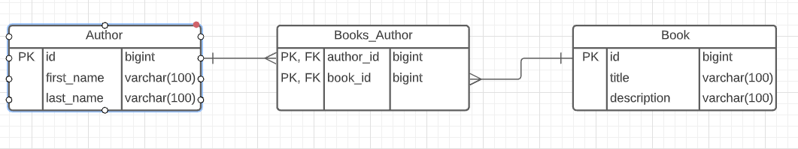
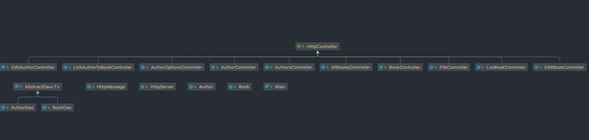

# Oppgave for eksamen i Avansert Java (PGR203) for emnet undervist i 2020

## Beskrivelse av funksjonalitet
På hovedsiden har man fire valg:

* List all author
  * lister ut alle forfattere
  * Lister ut forfatterens bøker
  * Redigere forfattere
* Add author
  * Registere nye forfattere
* List all books
  * Lister ut alle bøker
  * Redigere bøker
  * Knytte forfattere til bøker
* Add book
  * Registere nye bøker

## Dokumentasjon på hvordan man bygger, konfigurerer og kjører løsningen
* Bytt directory til pgr203konteeksamen-harryapp
* Kjør `mvn package`
* Opprett pgr203.properties i Root, og denne skal inneholde følgende:
    * `dataSource.url=[database-url]`
    * `dataSource.username=[brukernavn]`
    * `datasource.password=[passord]`
* Kjør `java -jar target/Exam-PGR203-Advanced-Java-Programming.jar`
* Åpne i nettleseren: http://localhost:8080/

## Diagram som viser datamodellen
ER Model

Class Diagram

## Ekstra leveranse utover minimum
* [x] Redirect etter POST: Når brukeren utfører en POST hadde det vært fint å sende brukeren tilbake til dit de var før. Det krever at man svarer med response code 303 See other og headeren Location
* [1/2] Tester som POST-er og GET-er norske tegn Når brukeren skriver inn en tekst på norsk må man passe på å få encoding riktig. Klarer du å lage en med action=POST og encoding=UTF-8 som fungerer med norske tegn? Klarer du å få æøå til å fungere i tester som gjør både POST og GET?
* [x] POST og GET til samme requestTarget Å opprette og liste spørsmål hadde vært logisk og REST-fult å gjøre med GET /api/questions og POST /api/questions. Klarer du å endre måten dudere hånderer controllers på slik at en GET og en POST request kan ha samme request target?
* [ ] Feilhåndtering Dersom noe alvorlig galt skjer vil serveren krasje. Serveren burde i stedet logge dette og returnere en status code 500 til brukeren
* [x] Welcome page Dersom brukeren går til http://localhost:8080 får man 404. Serveren burde i stedet returnere innholdet av index.html d for din server? Tips: ikonet er en binærfil og ikke en tekst og det går derfor ikke an å laste den inn i en StringBuilder
* [x] FileController I forelesningen har vi sett på å innføre begrepet Controllers for å organisere logikken i serveren. Unntaket fra det som håndteres med controllers er håndtering av filer på disk. Kan du skrive om HttpServer til å bruke en FileController for å lese filer fra disk?
